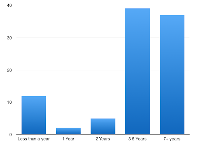
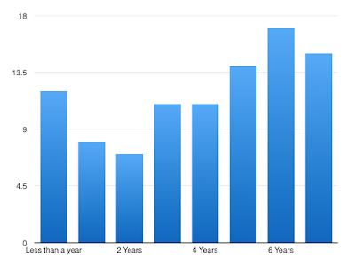
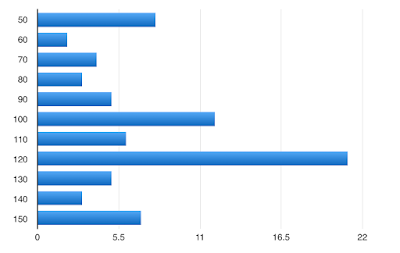
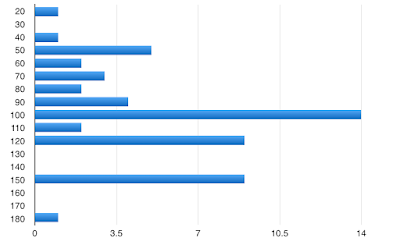

# Fall 2015 Developer Survey

Originally published at [http://iphoneramble.blogspot.com/2015/10/ios-and-mac-developer-survey-october.html](http://iphoneramble.blogspot.com/2015/10/ios-and-mac-developer-survey-october.html).

---

Our iOS and Mac developer Slack group has grown! The group now has over 200 developers from the Utah area. We ran the survey again using polldaddy.com. 95 people responded. We added a few new questions around education that produced some very interesting results.

**What type of development do you do? (allowed multiple selections)**

<table class="survey-response">
	<tr>
        <td>iOS</td>
        <td>94</td>
        <td>98.9%</td>
	</tr>
	<tr>
        <td>Mac</td>
        <td>19</td>
        <td>20.0%</td>
	</tr>
	<tr>
        <td>Android</td>
        <td>14</td>
        <td>14.7%</td>
	</tr>
	<tr>
        <td>Other</td>
        <td>9</td>
        <td>9.5%</td>
	</tr>
</table>

**What type of iOS apps do you develop? (allowed multiple selections)**

<table class="survey-response">
	<tr>
        <td>Productivity/Business</td>
        <td>70</td>
        <td>73.7%</td>
	</tr>
	<tr>
        <td>Utilities</td>
        <td>37</td>
        <td>38.9%</td>
	</tr>
	<tr>
        <td>Education</td>
        <td>34</td>
        <td>35.8%</td>
	</tr>
	<tr>
        <td>Social Networking</td>
        <td>23</td>
        <td>24.2%</td>
	</tr>
	<tr>
        <td>Health or medical</td>
        <td>20</td>
        <td>21.1%</td>
	</tr>
	<tr>
        <td>Entertainment</td>
        <td>17</td>
        <td>17.9%</td>
	</tr>
	<tr>
        <td>Games</td>
        <td>17</td>
        <td>17.9%</td>
	</tr>
	<tr>
        <td>Other</td>
        <td>6</td>
        <td>6.3%</td>
	</tr>
</table>

**How much do you use Swift?**

<table class="survey-response">
	<tr>
        <td>All my new projects are in Swift</td>
        <td>47</td>
        <td>49%</td>
	</tr>
	<tr>
        <td>Everything</td>
        <td>20</td>
        <td>21%</td>
	</tr>
	<tr>
        <td>Some</td>
        <td>18</td>
        <td>19%</td>
	</tr>
	<tr>
        <td>None yet</td>
        <td>10</td>
        <td>11%</td>
	</tr>
</table>

**My programming education includes: (allowed multiple selections)**

<table class="survey-response">
	<tr>
        <td>Self taught</td>
        <td>48</td>
        <td>50.5%</td>
	</tr>
	<tr>
        <td>A college degree in CS or CE</td>
        <td>47</td>
        <td>49.5%</td>
	</tr>
	<tr>
        <td>A college degree (other)</td>
        <td>25</td>
        <td>26.3%</td>
	</tr>
	<tr>
        <td>A code bootcamp like Dev Mountain</td>
        <td>15</td>
        <td>15.8%</td>
	</tr>
	<tr>
        <td>Formal, online code classes</td>
        <td>7</td>
        <td>7.4%</td>
	</tr>
	<tr>
        <td>Other</td>
        <td>5</td>
        <td>5.3%</td>
	</tr>
</table>

**How long have you been programming professionally?**

**How long have you been programming iOS/Mac?**

**How do the apps you have developed recently make money? (allowed multiple selections)**

<table class="survey-response">
	<tr>
        <td>They don’t need to directly (e.g. banking app)</td>
        <td>48</td>
        <td>50.5%</td>
	</tr>
	<tr>
        <td>Paid app</td>
        <td>37</td>
        <td>38.9%</td>
	</tr>
	<tr>
        <td>IAP</td>
        <td>23</td>
        <td>24.2%</td>
	</tr>
	<tr>
        <td>VC funded, not worrying about that right now</td>
        <td>18</td>
        <td>18.9%</td>
	</tr>
	<tr>
        <td>Subscriptions</td>
        <td>17</td>
        <td>17.9%</td>
	</tr>
	<tr>
        <td>Ads</td>
        <td>10</td>
        <td>10.5%</td>
	</tr>
	<tr>
        <td>Other</td>
        <td>7</td>
        <td>7.4%</td>
	</tr>
</table>

**How do you primarily make money from apps/mobile ecosystem?**

<table class="survey-response">
	<tr>
        <td>I work full time for a company</td>
        <td>49</td>
        <td>51.6%</td>
	</tr>
	<tr>
        <td>Publishing apps that I develop</td>
        <td>37</td>
        <td>38.9%</td>
	</tr>
	<tr>
        <td>Contract app development</td>
        <td>23</td>
        <td>24.2%</td>
	</tr>
	<tr>
        <td>Teaching others how to do it</td>
        <td>18</td>
        <td>18.9%</td>
	</tr>
	<tr>
        <td>Other</td>
        <td>17</td>
        <td>17.9%</td>
	</tr>
	<tr>
        <td>Making tools for other developers</td>
        <td>10</td>
        <td>10.5%</td>
	</tr>
	<tr>
        <td>I work part time for a company</td>
        <td>7</td>
        <td>7.4%</td>
	</tr>
</table>

**If you work full time for someone else, what is your annual salary?**

Average $106,000

**If you work full time for someone else, what other benefits do you get?**

<table class="survey-response">
	<tr>
        <td>Paid Vacation</td>
        <td>67</td>
        <td>93.1%</td>
	</tr>
	<tr>
        <td>Health Insurance</td>
        <td>67</td>
        <td>93.1%</td>
	</tr>
	<tr>
        <td>401k/retirement</td>
        <td>44</td>
        <td>61.1%</td>
	</tr>
	<tr>
        <td>iDevices, as needed</td>
        <td>39</td>
        <td>54.2%</td>
	</tr>
	<tr>
        <td>Stock options</td>
        <td>35</td>
        <td>48.6%</td>
	</tr>
	<tr>
        <td>Pays for service plan for iPhone</td>
        <td>14</td>
        <td>19.4%</td>
	</tr>
	<tr>
        <td>Other</td>
        <td>9</td>
        <td>12.5%</td>
	</tr>
	<tr>
        <td>Profit Sharing</td>
        <td>7</td>
        <td>9.7%</td>
	</tr>
</table>

**Do you do contract app development? Or does the company you work for hire you out…**

<table class="survey-response">
	<tr>
        <td>Sometimes, on the side</td>
        <td>44</td>
        <td>46.0%</td>
	</tr>
	<tr>
        <td>No</td>
        <td>42</td>
        <td>44.0%</td>
	</tr>
	<tr>
        <td>Yes, full time</td>
        <td>9</td>
        <td>9.0%</td>
	</tr>
</table>

**What is your (or your employer's) hourly rate for contract app development?**

Average $103/hr