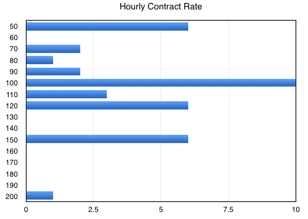
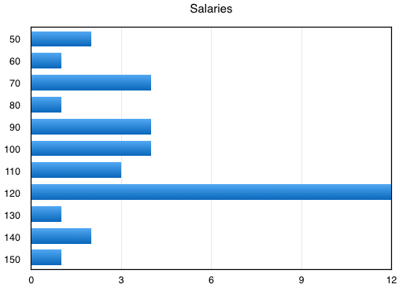

# Spring 2015 Developer Survey

Originally posted at [http://iphoneramble.blogspot.com/2015/04/ios-and-mac-developer-demographics.html](http://iphoneramble.blogspot.com/2015/04/ios-and-mac-developer-demographics.html).

---

A slack group has assembled recently in the Utah area around iOS and Mac development. It's become a nice little group. But I'm curious how it differs from the developer community from 2009, when I first started getting into iOS development. So I put together two quick polls. One specifically covered salaries and benefits. The other poll covered everything else. I'll cover the bigger one first.

**What type of Developer are you? (52 responses)**

<table class="survey-response">
	<tr>
		<td>iOS</td>
		<td>52</td>
		<td>100%</td>
	</tr>
	<tr>
		<td>Mac</td>
		<td>10</td>
		<td>19.2%</td>
	</tr>
	<tr>
		<td>Android</td>
		<td>4</td>
		<td>7.7%</td>
	</tr>
</table>

**What type of iOS apps do you develop? (52 responses)**

<table class="survey-response">
	<tr>
        <td>Productivity/Business</td>
        <td>43</td>
        <td>82.7%</td>
	</tr>
	<tr>
        <td>Utilities</td>
        <td>21</td>
        <td>40.4%</td>
	</tr>
	<tr>
        <td>Games</td>
        <td>8</td>
        <td>15.4%</td>
	</tr>
	<tr>
        <td>Entertainment</td>
        <td>8</td>
        <td>15.4%</td>
	</tr>
	<tr>
        <td>Health</td>
        <td>2</td>
        <td>3.8%</td>
	</tr>
	<tr>
        <td>Social Networking</td>
        <td>1</td>
        <td>1.9%</td>
	</tr>
	<tr>
        <td>Education</td>
        <td>1</td>
        <td>1.9%</td>
	</tr>
	<tr>
        <td>IOT</td>
        <td>1</td>
        <td>1.9%</td>
	</tr>
	<tr>
        <td>Music</td>
        <td>1</td>
        <td>1.9%</td>
	</tr>
</table>

**Are you using Swift yet? (51 responses)**

<table class="survey-response">
	<tr>
        <td>Some</td>
        <td>27</td>
        <td>52.9%</td>
	</tr>
	<tr>
        <td>Not Yet</td>
        <td>14</td>
        <td>27.5%</td>
	</tr>
	<tr>
        <td>Only</td>
        <td>10</td>
        <td>19.6%</td>
	</tr>
	<tr>
        <td>Never!</td>
        <td>0</td>
        <td>0.0%</td>
	</tr>
</table>

I asked what people were using to develop apps. e.g. Xcode, App Code, Xamarin.

4% were using App Code. Everyone else used Xcode.

**How do the apps you have developed recently make money? (52 responses)**

<table class="survey-response">
	<tr>
        <td>App doesn't need to make money directly (e.g. banking app)</td>
        <td>22</td>
        <td>42.3%</td>
	</tr>
	<tr>
        <td>Paid App</td>
        <td>15</td>
        <td>28.8%</td>
	</tr>
	<tr>
        <td>Other</td>
        <td>3</td>
        <td>5.8%</td>
	</tr>
	<tr>
        <td>IAP</td>
        <td>7</td>
        <td>13.5%</td>
	</tr>
	<tr>
        <td>Ads</td>
        <td>1</td>
        <td>1.9%</td>
	</tr>
	<tr>
        <td>VC Funded</td>
        <td>1</td>
        <td>1.9%</td>
	</tr>
	<tr>
        <td>IAP+Ads</td>
        <td>1</td>
        <td>1.9%</td>
	</tr>
	<tr>
        <td>Both Paid and IAP</td>
        <td>2</td>
        <td>3.8%</td>
	</tr>
</table>

**How do you primarily make money from apps? (52 responses)**

<table class="survey-response">
	<tr>
        <td>I develop apps for a company</td>
        <td>33</td>
        <td>63.5%</td>
	</tr>
	<tr>
        <td>I publish apps myself</td>
        <td>9</td>
        <td>17.3%</td>
	</tr>
	<tr>
        <td>I do contract app development</td>
        <td>7</td>
        <td>13.5%</td>
	</tr>
	<tr>
        <td>I work for Apple</td>
        <td>2</td>
        <td>3.8%</td>
	</tr>
	<tr>
        <td>Teaching</td>
        <td>1</td>
        <td>1.9%</td>
	</tr>
</table>

**Do you do contract app development? (52 responses)**

<table class="survey-response">
	<tr>
        <td>Sometimes, on the side</td>
        <td>32</td>
        <td>61.5%</td>
	</tr>
	<tr>
        <td>No</td>
        <td>15</td>
        <td>28.8%</td>
	</tr>
	<tr>
        <td>Yes, full time</td>
        <td>5</td>
        <td>9.6%</td>
	</tr>
</table>

**What is your (or your employer's) hourly rate for contract app development? (37 responses)**

The average rate was $104. If I remove some of the outliers, the average is $112.

**Salaries and benefits poll (35 responses):**

This poll ran separately from the above.

The average over the whole dataset was $105,000. I tried to exclude some of the outliers ($85k to $130k) and the average was $112,000. But that is a pretty strong signal at $120k.

**Benefits:**

<table class="survey-response">
	<tr>
        <td>Health Insurance</td>
        <td>31</td>
        <td>91.2%</td>
	</tr>
	<tr>
        <td>401k/Retirement</td>
        <td>22</td>
        <td>64.7%</td>
	</tr>
	<tr>
        <td>Free iDevices, as needed</td>
        <td>18</td>
        <td>52.9%</td>
	</tr>
	<tr>
        <td>Stock Options</td>
        <td>19</td>
        <td>55.9%</td>
	</tr>
	<tr>
        <td>Profit Sharing</td>
        <td>6</td>
        <td>17.6%</td>
	</tr>
	<tr>
        <td>Pays for service plan for iPhone</td>
        <td>5</td>
        <td>14.7%</td>
	</tr>
</table>

