# Fall 2018 Developer Survey

Originally published at [http://iphoneramble.blogspot.com/2018/10/utah-ios-and-mac-developer-survey-fall.html](http://iphoneramble.blogspot.com/2018/10/utah-ios-and-mac-developer-survey-fall.html).

---

This is our eighth group survey. Our Slack group now has 592 members. Our group is primarily focused on iOS or Mac developers in the Utah area. 125 people responded to the survey.

**What type of development do you do professionally? (allowed multiple selections)**

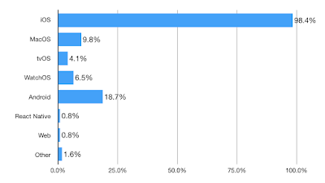

**What type of iOS apps do you develop? (allowed multiple selections)**

**What is the primary language that you use for development?**

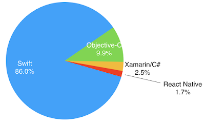

**My education includes: (allowed multiple selections)**

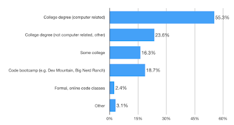

**How long have you been programming professionally?**

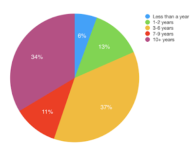

**How long have you been programming iOS/Mac professionally?**

**How do the apps you have developed recently make money? (allowed multiple selections)**

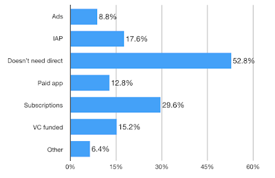

**How do you primarily make money from apps/mobile ecosystem?**

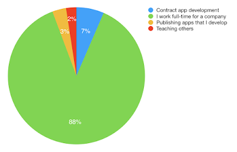

**If you work full time for someone else, what is your annual salary?**

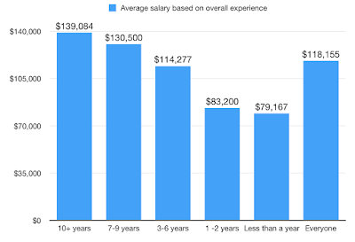

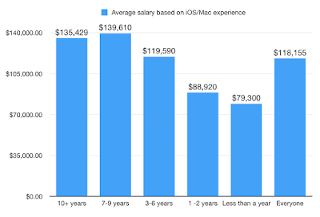

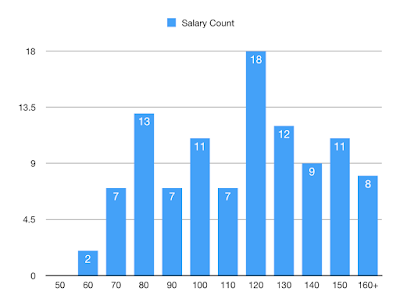

In other words, there were 11 people that said that they received a salary of between $100,000 and $110,000.

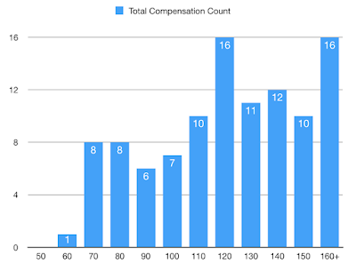

In other words, there were 6 people that said that they received total compensation of between $90,000 and $100,000.

**If you work full time for someone else, what other benefits do you get?**

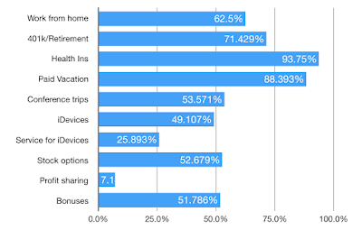

**Do you do contract app development? Or does the company you work for hire you out for contract app development?**

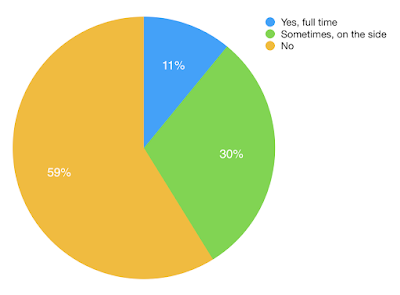

**What is your (or your employer's) hourly rate for contract app development?**

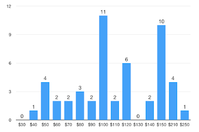

- Average contract rate (All): $115/hour
- Average contract rate (Contractors): $114/hour
- Average contract rate (Employed): $116/hour
