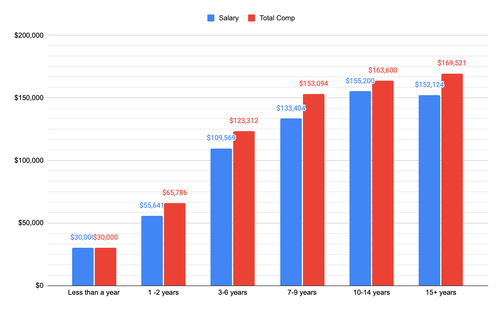

# Spring 2021 Developer Survey

Originally published at [https://jslinker.github.io/developer-survey/2021-6/](https://jslinker.github.io/developer-survey/2021-6/).

---

This is our tenth group survey. Our Slack group now has 784 members. Our group is primarily focused on iOS or Mac developers in the Utah area. 173 people responded to the survey.

**AUTHOR**: Joseph Slinker, Engineering Manager at [Lucid Software](https://lucid.co/). 

**PUBLISHED**: June 2021

**What type of development do you do professionally?**

Multiselect: *iOS, macOS, tvOS, watchOS, Android, Other (Please specify)*

"Other" responses include: *.Net, BE / Server work, Firmware (C++), Flutter, Frontend & Backend, React Native, Unity, Web (backend), and Windows.*

**How do you primarily code your apps?**

Single select: Objective-C, Swift, Xamarin/C#, Other (Please specify)

"Other" responses include: *C++, Flutter, JavaScript, TypeScript, Kotlin, and React Native.*

**What type of iOS apps do you develop?**

Multiselect: *Productivity or business, Utilities, Education, Social networking, Entertainment, Games, Internet-of-things, Healthcare, Other (Please specify)*

"Other" responses include: *Audio, Video, Crafting, Entertainment, Family history, Finance, Food services, Health and fitness, Lifestyle, Marketplace, Real estate, Religion, SDK, Shopping & delivery, and Utilities.*

**How do the apps you have developed recently make money?**

Multiselect: *Ads, In-app purchases, The app doesn't need to make money directly, Paid app, Subscriptions, VC funded (not worrying about that right now, and Other (Please specify).*

"Other" responses include: *B2B contracts, eCommerce, Physical product sales, SDK sales contracts, and Taking a percent of transactions.*

**My education includes:**

Multiselect: *College degree in Computer Science, Computer Engineering, programming of some kind, etc., College degree (not computer related, other), Some college, Code bootcamp (e.g. Dev Mountain, Big Nerd Ranch), Formal, online code classes, Other (Please specify)*

"Other" responses include: *Technical college, and Self taught*

**How long have you been programming professionally?**

Single select: *Less than a year, 1 -2 years, 3-6 years, 7-9 years, 10-14 years, 15+ years*

**How long have you been programming for iOS/Mac professionally?**

Single select: *Less than a year, 1 -2 years, 3-6 years, 7-9 years, 10-14 years, 15+ years*

**Your Location (County):**

Single select: *Salt Lake County, Utah County, Weber/Davis County, Other Utah County, Not-Utah, I would rather not say*

**How do you primarily make money from the apps/mobile ecosystem?**

Single select: *I work full time for a company, Publishing apps that I develop, Contract app development, Teaching others how to do it, QA/Software Testing, I don't yet, and Other (Please specify).*

**If you work full time for someone else, what is your annual base salary?**

Short text: *Results are displayed as a histogram of dollar values. (i.e. $42,000 represents all responses from $21,000 through $42,000)*

**If you work full time for someone else, what is your total annual compensation (salary+bonus+)?**

Short text: *Results are displayed as a histogram of dollar values. (i.e. $48,000 represents all responses from $24,000 through $48,000)*

**Average compensation by iOS/Mac experience**

Average of base salary and total compensation grouped by years of iOS/Mac development experience. You'll notice in this data set that some developers with years of industry experience are doing iOS and Mac development for the first time.

**Average compensation by total programming experience**

Average of base salary and total compensation grouped by years of programming experience. You'll notice this metric is a much more consistent predictor of salary when compared to iOS/Mac experience.

**How much money did you make in the last 12 months from apps that you personally publish on the App Store?**

Short text: *Results are displayed as a histogram of dollar values. (i.e. $26,000 represents all responses from $13,000 through $26,000)*

**If you work full time for someone else, what other benefits do you get?**

Multiselect: *Work from home, 401k/Retirement, Health Insurance, Paid Vacation, Trips to conferences (e.g. WWDC), iDevices as needed, Pays for service plan for iPhone, Stock options or stock grants or RSU grants, Profit sharing, Bonuses*

"Other" responses include: *HSA Contributions, Paid lunches, Retreats, and Unlimited PTO*

**What will be your company's remote work policy after COVID is over?**

Single select: *Remote only available to individuals as an approved exception, Remote 1, 2, 3, or 4 day(s) per week, Full-time remote for everyone that wants it, Full-time remote as the only option, I don't know*

**If you work for someone else, how big is the mobile team?**

Single select: *Just me, 2 developers, 3-5 developers, 6-10 developers, 11+ developers*

**Do you do contract app development? Or does the company you work for hire you out for contract app development?**

Single select: *No, Sometimes, on the side, Yes, full time*

**What is your (or your employer's) hourly rate for contract app development?**

Short text: *Results are displayed as a histogram of dollar values. (i.e. $100 represents all responses from $50/hr through $100/hr)*

**How many hours per week do you typically spend on contract work?**

Short text: *Results are displayed as a histogram of hours worked. (i.e. 20 represents all responses from 10 hours per week through 20 hours per week)*

**Quality of life:**

Rating from 1 to 5: *Are you happy with your current work-life balance? Do you feel like your current salary (or hourly rate) is at least equal to your market value? How satisfied are you with your total compensation package? How satisfied are you with your benefits package? (Medical, dental, PTO, etc.)*

