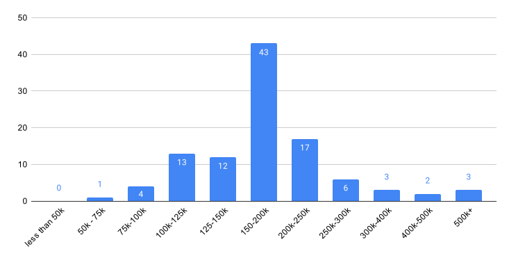

# Fall 2023 Developer Survey

This is our eleventh group survey. Our Slack group now has 910 members. Our group is primarily focused on iOS or Mac developers in the Utah area. 139 people responded to the survey.

**AUTHOR**: Jacob Bullock 

**PUBLISHED**: October 2023

**What type of development do you do professionally?**

Multiselect

`Other` responses include: React Native, AWS, Unity, Embedded, Swift on Server / Vapor, Backend, Firmware, ERP Integration & Migration and IT leadership, .NET, Linux, Flutter,Systems / embedded development, Windows 

**How old are you?**

Single Select

**How do you primarily code your apps?**

Single Select

`Other` responses include: Kotlin, Java, C, Python, VS Code (lots of web)

**What type of apps do you develop?**

Multiselect

`Other` responses include: Enterprise applications, Real Estate, Food & Beverage, Retail, E-commerce, Communication , internal testing tools, Commerce, News, Maps, Privacy

**How do the apps you have developed recently make money?**

Multiselect

`Other` responses include: Marketplace service fee, E-commerce, IOT

**If you use subscriptions, what frequency do users tend to subscribe?**

Single Select

**My education includes:**

Multiselect

`Other` responses include:  Online learning, trade school certificate, Self-taught, books, Apprenticeship after self taught, Associates degreee in Computer Science, MTECH iOS Program

**How long have you been programming professionally?**

Single Select

**How long have you been programming iOS/Mac professionally?**

Single Select

**Do you struggle with Imposter Syndrome?**

Single Select

**Your Location (County)**

Single Select

**Employer Location**

Single Select

**What is your company's current return to office (RTO) policy**

Single Select

**How do you primarily make money from the apps/mobile ecosystem?**

Single Select

**If you work full time for someone else, what is your annual base salary?**

Single Select

**If you work full time for someone else, what other benefits do you get?**

Single Select

`Other` responses include: perks and stipends for things like internet and gyms, Discounts on products we make

**If you work full time for someone else, what is your total annual compensation (salary+bonus+)**

Single Select

**If you work for a company, how big is the mobile development team?**

Single Select

**If you publish your own app, how much money did you make in the last 12 months from apps that you personally publish on the App Store?**

Single Select

**How much Paid Time Off do you receive at your company per year?**

Single Select

**If you have unlimited time off, how much time do people typically take off per year?**

Single Select

**Quality of Life Questions**

1-5 Scale, 1 being low, and 5 being high

**Do you feel you learn regularly from others around you at work?**

Multiselect

`Other` responses include: I'm the only iOS dev so I learn significantly less from others (web, ux) I work with, I don't really get much of a chance to work together with people on the team.

Had an excellent iOS mentor who I learned so much from

I learn usually by seeing what other people do in the code. 

I learn by making huge mistakes

I would like to work with people smarter than me

I have a manager that mentors me

I'm the person people come to learn from and I try to reach out to other team members to help me figure stuff out

**Does your company hire and support / mentor Junior Developers?**

Single Select

**How much SwiftUI is your app using?**

Single Select

**If you are NOT shipping SwiftUI Features, what is the primary reason why?**

Single Select

**Do you know there is a #jobs channel in the utah slack channel and a spreadsheet for members to post current positions?**

Single Select

**Does your company require a live coding interview for applicants?**

Single Select

**Do you do contract app development? Or does the company you work for hire you out for contract app development?**

Single Select

**What is your (or your employer's) hourly rate for contract app development?**

Text Entry

**How many hours per week do you typically spend on contract work?**

Text Entry

**How often do you bill your clients?**

Single Select

**From the time you invoice, how long until you are paid?**

Single Select

**As a contractor, what type of roles do you typically have?**

Multi Select

**Do you hire subcontractors?**

Single Select

